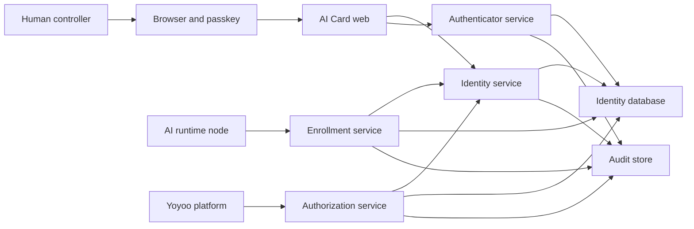

# AI Card v0.2 Security Threat Model

## Executive Summary

AI Card 是跨平台身份与授权基础设施，最高风险不是普通资料泄露，而是身份被冒用、控制权被夺取、平台获得超额数据或权限、AI 节点密钥失窃后持续代表持卡人行动。Phase 8A 新增密码账号和可枚举顺序公开编号；Phase 8B 新增产品回调、产品本地会话和跨产品映射，必须额外防范撞库、账号枚举、幂等键泄露、回调混淆和产品越界读取。仓库已完成本地自动化自测，但尚未完成独立安全审查、生产密钥管理与公网加固。完成独立安全审查前不得公网发布。

## Scope And Assumptions

### In Scope

- 人类 Principal、AI Principal、AI Card 与 Controller 的身份关系。
- 密码注册、登录、会话、限流，以及 Passkey 注册、登录、重新验证、恢复和撤销。
- AI Card 邀请、认领、运行节点密钥与节点撤销。
- 平台授权码、PKCE、access token、refresh token、scope 和撤销。
- 公开正面、平台可见、私有背面与系统保险库的字段隔离。
- 审计事件、日志脱敏、备份恢复和安全运维边界。

### Out Of Scope

- 支付、钱包、信用、组织多人审批和控制权转移。
- Yoyoo 的消息内容、文件内容、任务内容与本地业务权限。
- 第三方开放注册和完整 OIDC/OAuth 一致性认证。
- 生产部署架构、云供应商、WAF、KMS 与 SOC 流程。

### Assumptions

- v0.2 仅在本地或明确受保护环境运行，不直接暴露到公网。
- AI 类型 Card 必须绑定一个已验证的人类 Controller。
- Yoyoo 是唯一允许的平台客户端；额外测试客户端仅用于证明 pairwise Subject 隔离。
- 所有正式流量最终使用 HTTPS；本地开发的 `localhost` 是唯一明文例外。
- 生产秘密将由专用 Secret/KMS 能力管理，数据库中只保存不可逆摘要或加密材料。
- 设计依据来自 [Product-Spec.md](../Product-Spec.md) 与 [DEV-PLAN.md](../DEV-PLAN.md)；仓库已有自测的运行时安全实现，但尚未经独立审查。

### Open Questions Before Public Deployment

- 正式域名、Relying Party ID、部署区域和数据驻留要求。
- 账户恢复是否引入人工审核、恢复码或第二个 Passkey。
- AI Card Controller 的法定身份核验等级和争议处理流程。
- 多租户隔离模型、峰值规模、限流预算与审计保留周期。

## System Model

### Primary Components

| Component | Responsibility | Current Status | Evidence |
| --- | --- | --- | --- |
| Web application | Card 创建、登录、公开正面、私有背面与平台授权同意/撤销 | Implemented through Phase 5B, self-tested | `src/app/` |
| Identity service | Principal、Card、Controller、Handle 与状态机 | Implemented, self-tested | `src/server/identity-service.ts` |
| Authenticator service | 密码 KDF、统一注册/登录、会话、限流与 Passkey challenge/响应验证 | Implemented through Phase 8A, self-tested | `src/server/authentication/` |
| Enrollment service | 邀请票据、AI 认领、节点公钥和撤销 | Implemented, self-tested | `src/server/agent-enrollment-service.ts` |
| Authorization service | 预注册客户端、授权码、PKCE、access/refresh token、幂等恢复、重放检测和撤销 | Implemented through Phase 5B, self-tested | `src/server/authorization/` |
| PostgreSQL | 身份、权威编号、密码/Passkey 凭据元数据、节点、平台授权摘要、加密恢复材料和审计 | Implemented through Phase 8A | `infra/postgres/migrations/0010_password_accounts.sql` |
| Platform client | Yoyoo 开发客户端与独立参考产品可获取平台专属 Subject 和最小声明 | Phase 8B local E2E self-tested | `reference-product/`, `e2e/reference-product-federation.spec.ts` |
| AI runtime node | 本机生成密钥，对挑战签名并代表 AI Card 连接 | Reference client implemented, E2E simulated | `scripts/agent-enrollment-reference.mts` |

### Data Flows And Trust Boundaries

- 人类浏览器 -> Web application：昵称、Handle、密码、Passkey 响应、授权同意；通过 HTTPS、精确 Origin/RP ID 校验、CSRF 防护、schema 校验、幂等事务和限流保护。
- Web application -> PostgreSQL：身份资料、凭据公钥、状态与审计；通过最小权限数据库账户、事务、唯一约束和字段级加密保护。
- Controller -> Enrollment service：AI 昵称与创建邀请请求；要求有效会话、近期 Passkey 重新验证和幂等键。
- AI runtime node -> Enrollment service：一次性票据、公钥、认领 ID 与签名；要求票据摘要匹配、未过期、未消费，并以事务完成认领。
- Platform client -> Authorization service：client ID、redirect URI、state、PKCE challenge、scopes；要求预注册客户端和精确 redirect URI 匹配。
- Authorization service -> Platform client：一次性 code、pairwise Subject、短期 token 与最小声明；code 绑定客户端、redirect URI、PKCE 和持卡人授权。
- Reference product -> AI Card public API：只通过 validation、token 和 userinfo HTTP 端点；产品 schema 不引用 AI Card 表，不读取内部 Principal ID。
- Runtime services -> Audit store：安全事件与关联 ID；禁止记录票据、授权码、Token、私钥和完整敏感请求体。

#### Diagram

## Assets And Security Objectives

| Asset | Why It Matters | Objective |
| --- | --- | --- |
| Principal 与 Card 绑定 | 决定一个人或 AI 的长期身份 | Integrity, Availability |
| Controller 关系 | 决定谁能管理、授权和撤销 AI Card | Integrity, Confidentiality |
| Passkey 公钥与元数据 | 支撑人类认证并辅助检测凭据异常 | Integrity, Availability |
| 密码派生值与 salt | 支撑统一账号登录，泄露后可被离线猜测 | Confidentiality, Integrity |
| 注册幂等记录 | 恢复未知结果并防止重复发卡 | Confidentiality, Integrity |
| AI 节点私钥 | 可代表 AI Card 发起认证；只能存在于节点本机 | Confidentiality, Integrity |
| 邀请票据与授权码 | 可在短时间内创建或换取身份能力 | Confidentiality, Integrity |
| Access/refresh token | 可代表 Card 调用平台授权范围内的接口 | Confidentiality, Integrity |
| 私有背面与保险库数据 | 包含授权、凭据、控制与恢复信息 | Confidentiality, Integrity |
| Pairwise Subject 映射 | 防止平台默认跨域关联同一持卡人 | Confidentiality, Integrity |
| 审计事件 | 用于追责、调查和恢复 | Integrity, Availability |
| 撤销状态 | 保证已撤销节点、凭据和授权不能复活 | Integrity, Availability |

## Attacker Model

### Capabilities

- 未认证远程攻击者可构造公开页面、登录、邀请认领和授权端点请求。
- 恶意或被攻陷的平台客户端可请求超额 scope、篡改 redirect URI、重放 code/token 或关联用户。
- 获得邀请指令、授权码、refresh token 或 AI 节点文件系统访问权的攻击者可尝试冒用身份。
- 已登录但权限较低的持卡人可尝试访问其他 Card 的背面、节点、授权与审计。
- 内部操作人员或数据库读取者可尝试访问不应暴露的身份映射和凭据材料。

### Non Capabilities

- 不假设攻击者能破解标准密码学算法或从 Passkey 公钥恢复私钥。
- 不假设攻击者拥有服务器主机、KMS 和数据库管理员的完全控制权；一旦拥有，该事件按基础设施失陷处理。
- 不把 Yoyoo 的本地权限漏洞归因给 AI Card；AI Card 只提供身份和被授权声明。

## Entry Points And Attack Surfaces

| Surface | How Reached | Trust Boundary | Notes | Evidence |
| --- | --- | --- | --- | --- |
| Public Card URL | Anonymous HTTPS GET | Internet -> Web | Card ID format, public projection only, rate limit | `Product-Spec.md` Visibility Model |
| Passkey options/verify | Browser HTTPS POST | Browser -> Authenticator | challenge, Origin, RP ID, user verification, expiry | `DEV-PLAN.md` Phase 3 |
| Password register/login | Browser HTTPS POST | Browser -> Authenticator | exact Origin, scrypt, generic errors, idempotency, session rotation, rate limit | `DEV-PLAN.md` Phase 8A |
| Invite creation | Authenticated HTTPS POST | Controller -> Enrollment | recent re-auth, Card ownership, idempotency | `Product-Spec.md` AI Card Enrollment |
| Invite claim | Agent HTTPS POST | Agent -> Enrollment | token hash, expiry, single use, public key proof | `DEV-PLAN.md` Phase 4 |
| Node challenge | Agent HTTPS POST | Agent -> Enrollment | nonce, signature, node/card state, replay cache | `Product-Spec.md` Authentication And Control |
| Authorization request | Platform browser redirect | Platform -> Authorization | client, exact redirect URI, state, PKCE, scope | `Product-Spec.md` Yoyoo Authorization |
| Token endpoint | Server HTTPS POST | Platform -> Authorization | code binding, PKCE verifier, audience, rotation | `DEV-PLAN.md` Phase 5 |
| Private Card back | Authenticated HTTPS | Browser -> Web | controller ownership, recent re-auth for high risk actions | `Product-Spec.md` Visibility Model |
| Revoke endpoints | Authenticated HTTPS POST | Controller -> Services | ownership, CSRF, idempotency, audit | `Product-Spec.md` Revoke |

## Top Abuse Paths

1. 攻击者窃取未使用的邀请票据 -> 抢先提交自己的公钥 -> 成为合法节点 -> 代表 AI Card 连接平台。
2. 恶意平台篡改 redirect URI 或截获授权码 -> 在自己的客户端换取 token -> 获取 Card 身份与授权数据。
3. 被攻陷的 AI 节点私钥持续签名 -> 攻击者冒充 AI Card -> 在撤销前执行未经授权的操作。
4. 已登录用户修改资源 ID -> 读取另一张 Card 的私有背面或撤销其授权 -> 造成隐私泄露或拒绝服务。
5. 平台保存全局 Card ID 并与 pairwise Subject 关联 -> 跨平台追踪持卡人 -> 破坏默认隐私隔离。
6. 攻击者重放 refresh token -> 服务端接受旧 token 并签发新 access token -> 撤销与轮换失效。
7. 恢复流程只依赖可转移的邮箱链接 -> 攻击者接管账户 -> 替换 Controller、Passkey 和节点。
8. 日志记录完整邀请票据或 token -> 日志读取者复制凭据 -> 绕过正常认证流程。
9. 自动化攻击者枚举 `AI_` 编号并对已知账号撞库 -> 猜中弱密码 -> 接管 Card 和平台授权。
10. 注册幂等键泄露 -> 攻击者尝试重放注册 -> 如果服务端不再验证密码则可创建新会话。

## Threat Model Table

Existing controls 仅表示仓库内已实现并自测的能力，不代表独立安全验收或生产上线；Recommended mitigations 仍是后续门禁。

| Threat ID | Threat Source | Prerequisites | Threat Action | Impact | Impacted Assets | Existing Controls And Evidence | Gaps | Recommended Mitigations | Detection Ideas | Likelihood | Impact Severity | Priority |
| --- | --- | --- | --- | --- | --- | --- | --- | --- | --- | --- | --- | --- |
| TM-001 | 窃取邀请内容的远程攻击者 | 获得仍有效的邀请票据并能访问认领端点 | 抢先认领或并发重复认领 | 成为合法 AI 节点 | Card 控制关系、节点身份 | 256-bit 票据只存哈希、15 分钟有效、事务单次消费、签名持钥证明、幂等查询秘密和集成测试 | 尚无认领通知、来源风险检测和独立并发压测 | 增加认领通知、来源检测、并发安全专项复核 | 票据重放/并发测试；异常来源告警 | High：邀请会经过复制链路 | High：可获得持续节点身份 | Critical |
| TM-002 | 恶意平台或授权链路攻击者 | 能发起授权请求或截获 code | 篡改 redirect URI、拦截 code 或绕过 PKCE | 换取平台 token | 授权码、Token、平台授权 | 预注册客户端、精确 redirect、S256 PKCE、5 分钟 code、单次消费、加密幂等恢复、client/redirect/subject 绑定及并发集成/E2E 测试 | 未独立协议安全审计 | 执行独立协议安全审计 | 错误 verifier、过期、重放和 URI 变体测试 | Medium：需要进入授权链路 | High：可代表 Card 调用平台 | High |
| TM-003 | 获得 token 的外部或内部攻击者 | 客户端、日志或存储泄露 token | 重放 access/refresh token | 持续访问已授权资源 | Token、授权、Card claims | 256-bit opaque token 只存 SHA-256 摘要；access 10 分钟有效；refresh 每次轮换，重放会事务性撤销整族及关联 access token；已有并发、重放和撤销测试 | 尚无生产 KMS、异常告警和独立审计 | 生产密钥管理、重放告警与独立审计 | 旧 refresh 重放测试；token family 告警 | Medium：依赖泄露 | High：可持续冒用 | High |
| TM-004 | 控制 AI 运行环境的攻击者 | 读取节点私钥或复制节点状态 | 对新 challenge 签名并冒用 AI Card | 以合法节点身份连接 | 节点私钥、Card 身份 | 仅规定私钥本机生成和节点独立撤销，见 `Product-Spec.md` Agent Enrollment | 无硬件保护、异常并发检测或节点证明 | 私钥不可导出、nonce 单次签名、独立 node ID/撤销、异常并发检测 | 多地并发、旧 nonce、撤销后签名测试 | Medium：节点环境不受服务完全控制 | High：可直接冒用 | High |
| TM-005 | 已认证的低权限用户 | 能猜测或获得其他资源 ID | 修改 ID 访问私有背面、保险库或撤销接口 | 隐私泄露或破坏他人身份 | Controller、凭据、授权、审计 | 已定义四层可见性，见 `Product-Spec.md` Visibility Model | 无服务端所有权校验或 DTO 投影 | 每请求按 Controller/Principal 授权；DTO 白名单；保险库无通用读取 API | 跨 Card 矩阵测试；响应字段快照 | Medium：对象 API 常见风险 | High：泄露或篡改高敏状态 | High |
| TM-006 | 公开访问者 | 可注册或查询 Handle/昵称 | 使用 Unicode 欺骗、相似 Handle 或枚举响应冒认他人 | 钓鱼、声誉损害、隐私探测 | Handle、昵称、身份可信度 | 昵称与 Handle 已分离，见 `Product-Spec.md` Identity Model | 无规范化、保留字、时延和限流实现 | Handle 仅 ASCII；昵称 NFKC；拒绝控制/不可见字符；统一响应；历史别名 | 同形字符语料；枚举时延；高频查询告警 | High：公开面直接可达 | Medium：通常需配合社工 | High |
| TM-007 | 账户接管攻击者 | 恢复流程或已登录会话被攻陷 | 添加凭据、替换 Controller 或撤销合法凭据 | 接管整张 Card | Controller、Passkey、全部授权 | 仅锁定 Passkey 和人类 Controller 要求，见 `Product-Spec.md` Authentication And Control | 恢复策略尚未确定 | Passkey UV required；高风险重新验证；双恢复因子或人工审核；冷却和通知 | 恢复演练；凭据/Controller 变更告警 | Medium：恢复面是高价值目标 | High：可永久夺权 | High |
| TM-008 | 平台或实现错误 | 服务端错误复用全局 ID 或泄露映射 | 将同一 Card 在多个平台的数据关联 | 破坏默认隐私隔离 | Pairwise Subject、Card ID | 每 `(client, principal)` 随机稳定 Subject、数据库唯一约束、默认不返回 Card ID、双客户端集成测试 | 未经独立隐私审计 | 增加跨平台响应快照和独立隐私审计 | 同 Card 两客户端隔离测试；claim 审计 | Medium：映射易误用 | Medium：造成跨域追踪 | High |
| TM-009 | 恶意平台客户端 | 能构造 scopes、audience 或资源请求 | 请求未同意 scope 或把 token 用于其他受众 | 获得超额数据或能力 | Grant、Scope、平台 claims | 预注册 scope allowlist、显式同意页、token audience/scopes 绑定、userinfo allowlist 与测试 | 尚无独立资源服务器 audience 验收 | Yoyoo 接入时逐资源校验 audience/scope | 未知 scope、错误 audience、scope 差异测试 | Medium：客户端可主动尝试 | High：越过用户授权 | High |
| TM-010 | 竞态、缓存或错误恢复流程 | 撤销后仍有缓存、备份或并发请求 | 让旧节点、凭据或授权恢复有效 | 撤销承诺失效 | 全部撤销状态 | 已规定撤销和历史归属语义，见 `Product-Spec.md` Revoke | 无版本、缓存和恢复策略 | 数据库权威状态、短 TTL、撤销版本、缓存失效、恢复后重建 deny state | 撤销传播 SLO；恢复演练；旧凭据回归 | Medium：分布式状态常见 | High：已阻断身份重新生效 | High |
| TM-011 | 日志、前端或错误处理缺陷 | 敏感值被调试输出或序列化 | 从日志/响应复制票据或 token | 绕过正常认证 | 票据、code、token、恢复材料 | 仅有“不回显长期秘密”原则，见 `Product-Spec.md` Product Principles | 无日志 allowlist、secret scan 或错误门禁 | 结构化日志 allowlist、统一脱敏、秘密类型禁止序列化、稳定错误码 | 仓库/日志 secret scan；错误路径集成测试 | Medium：开发阶段常发生 | High：泄露值可直接重放 | High |
| TM-012 | 自动化远程攻击者 | 可访问公开 Card、challenge 或授权入口 | 枚举身份或消耗昂贵资源 | 服务降级和隐私探测 | 可用性、公开身份 | v0.1 限受保护环境，见 `Product-Spec.md` Non-Functional Requirements | 无限流、预算或压测证据 | 分层限流、challenge 上限、负缓存、超时、成本预算 | 429、延迟、队列深度和枚举模式告警 | High：公开后容易自动化 | Medium：通常不直接夺权 | Medium |
| TM-013 | 撞库攻击者 | 可枚举 Card ID/Handle 并持有外部泄露密码字典 | 高频尝试账号密码并通过响应或时序区分账号 | 接管人类 Card | 密码凭据、Card、Grant | scrypt 随机 salt、未知账号等价 KDF、通用错误、按账号限流、会话轮换与集成测试 | 尚无 IP/设备风控、泄露密码检测和强制 MFA | 公网前增加网关分层限流、风险登录通知、可选 MFA 和泄露密码阻断 | 连续失败、多账号同源、成功前大量失败告警 | High：公网密码入口必然被扫描 | High：可直接接管身份 | Critical |
| TM-014 | 获得注册重试材料的攻击者 | 幂等键、客户端和注册资料泄露 | 重放原注册并尝试恢复会话 | 绕过登录 | 注册记录、会话 | 幂等键只存 SHA-256、最小 32 位 Base64URL、重试校验资料指纹与原密码、错误密码回归测试 | 浏览器或调试工具仍可在请求期间读到原幂等键 | 客户端短期保持、不写日志、网关脱敏并监控异常重放 | 同键多源重放、密码失败与会话签发对账 | Low：需同时获得多项材料 | High：如实现回归可接管账号 | High |

## Criticality Calibration

- **Critical**：无需服务器权限即可永久夺取 Card 控制权，或批量签发可用身份凭据。例：邀请并发产生多个合法节点、任意 Controller 替换。
- **High**：可冒用单个身份、读取私有背面、绕过 scope 或使撤销失效。例：refresh token 重放、跨 Card IDOR、错误 audience 接受。
- **Medium**：需要额外条件且影响可恢复，或主要影响可用性与可见隐私。例：公开 Card 枚举、单用户限流耗尽、Handle 抢注。
- **Low**：不涉及身份、秘密或授权，影响有限且有明确人工恢复路径。例：公开昵称短暂显示延迟、非敏感审计展示排序错误。

## Required Security Gates

1. Phase 1：严格环境校验、安全响应头、统一错误结构、Secret scan 和 CI 基线。
2. Phase 2：数据库唯一约束、所有可见性 DTO 的字段白名单与跨 Card 授权测试。
3. Phase 3：Passkey challenge 单次/限时、Origin/RP ID/UV 校验与高风险重新验证。
4. Phase 4：邀请并发事务、票据摘要、节点签名重放防护和独立撤销。
5. Phase 5：RFC 9700 风格授权码安全、PKCE、token rotation/reuse detection 和 scope/audience 测试。
6. Phase 6：Yoyoo 只使用 pairwise Subject 建本地映射，不把 AI Card 当成本地权限系统。
7. Phase 7：独立安全审查、备份恢复、撤销恢复验证和部署回滚演练。
8. Phase 8A：数据库权威发号、scrypt 密码存储、通用登录错误、重试密码验证、限流、会话轮换和审计。
9. Phase 8B：公共 HTTP 接口边界、精确回调、产品 CSRF、加密 flow 恢复、产品库无跨 schema 外键和失败不建替代身份。

## Focus Paths For Security Review

| Path | Why It Matters | Threats |
| --- | --- | --- |
| `src/server/authentication/` | 密码 KDF、统一注册/登录、Passkey challenge、Origin/RP ID 和会话认证 | TM-006, TM-007, TM-013, TM-014 |
| `src/server/enrollment/` | 单次邀请、认领事务、节点签名与撤销 | TM-001, TM-004, TM-010 |
| `src/server/authorization/` | 授权码、PKCE、token、scope 和 audience | TM-002, TM-003, TM-009 |
| `src/server/identity/` | Principal、Card、Controller 和状态机权威逻辑 | TM-005, TM-007, TM-010 |
| `src/server/visibility/` | 四层字段投影和数据最小化 | TM-005, TM-008 |
| `src/server/audit/` | 审计完整性与秘密脱敏 | TM-010, TM-011 |
| `src/server/db/` | 唯一约束、事务、撤销与 pairwise 映射 | TM-001, TM-008, TM-010 |
| `tests/security/` | 攻击路径和边界回归门禁 | All |

## Quality Check

- [x] 已覆盖公开、认证、邀请、节点、授权、Token、撤销和审计入口。
- [x] 每条主要信任边界至少对应一个威胁。
- [x] 已区分设计、仓库自测、独立安全验收和生产上线状态。
- [x] 已明确 v0.1 部署假设和公网前开放问题。
- [x] 已给出稳定 Threat ID、优先级、控制和验证方式。
